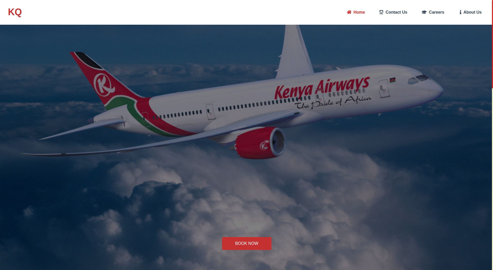
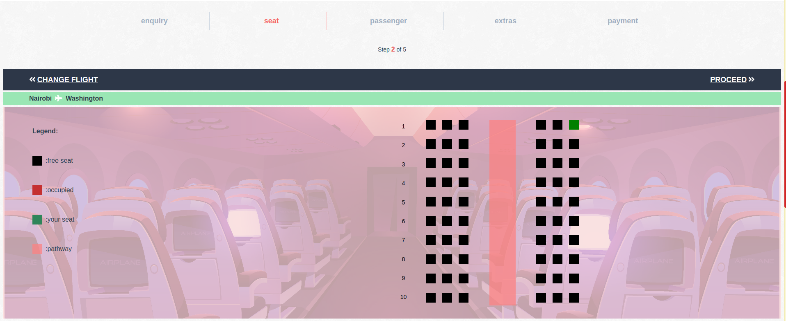
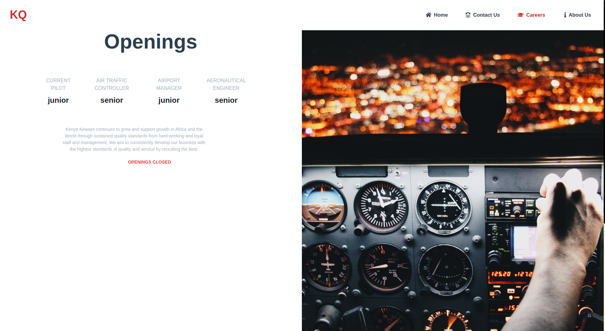

# [A Flight Booking Application Concept](https://kenya-airways.vercel.app/)

**Setup**

```bash
npm install
npm run serve
```

**Functionalities**

 ✔ Type search for destinations

 ✔ Seat selection

 ✔ Print ticket

Created in partial fulfillment of HCI Design course in Computer Science to demonstrate HCI Design Concepts.



---------------------------------------

 ✔ Ensure what has to be done is obvious to the user "BOOK NOW"

 ✔ Keep it simple

--------------------------------------



--------------------------------------

 ✔ Familiarity: ensure the booking process is in line with industry standards

 ✔ Syntesizability: Make it intuitive enough for the user to learn on the fly

--------------------------------------



-------------------------------------

 ✔ Ensure there is consistency in the design: fonts, colors

 ✔ Ensure the design is aesthetically pleasing


     
     